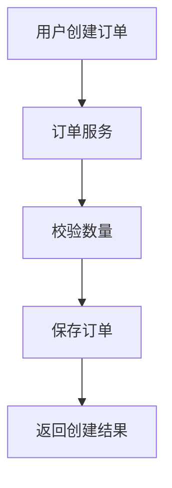

# 订单服务技术架构

## 模块职责
- create_order：创建订单
- get_order：查询订单
- cancel_order：取消订单
- get_order_status：查询状态

## 技术标识
DEEPMAP-TECH-ORDER-001

## Mermaid 流程

```mermaid
flowchart TD
    A[用户创建订单] --> B[订单服务]
    B --> C[校验数量]
    C --> D[保存订单]
    D --> E[返回创建结果]
```
